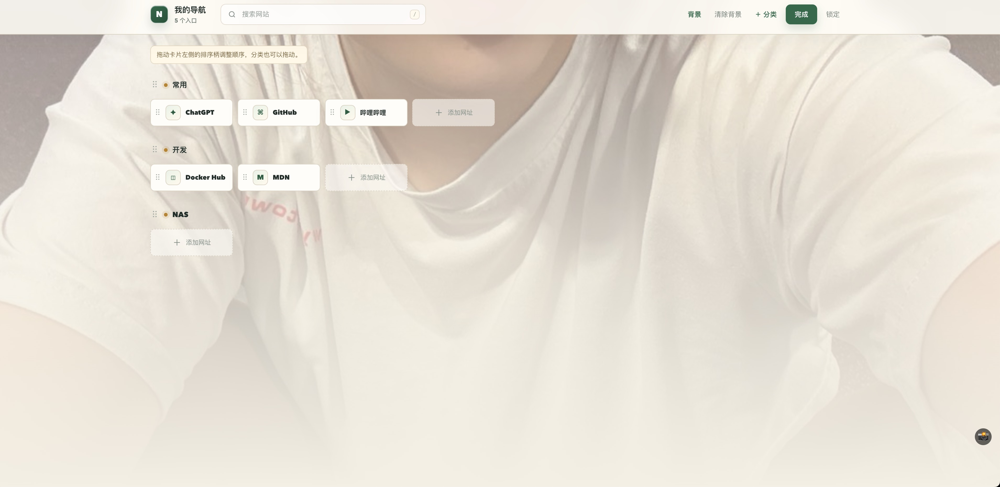
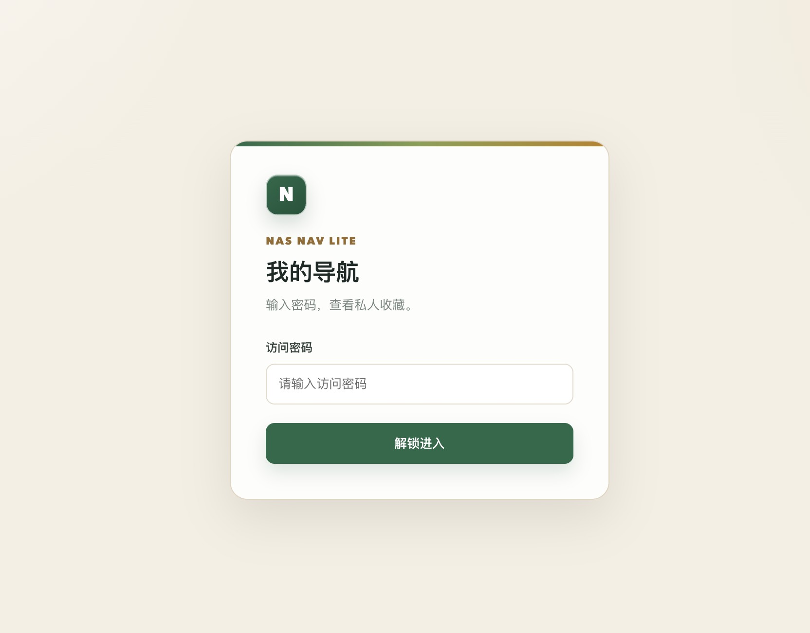

# NAS Nav Lite · 私人导航页

轻量白色导航首页。Go 1.23 + Vue 3.5.13；Vue 脚本随 Go `//go:embed` 编入程序，访问时无需外部 CDN；部署无需 Node.js、npm、数据库。

## 界面预览

### 导航编辑



### 登录

<p align="center">
  
</p>

## 功能

- 视觉设计：航海罗盘现代矢量 Logo 与高清 Favicon / Apple Touch Icon；纯净高级现代浅色系（Clean Light Theme）。
- 浏览模式：自适应卡片网格、实时搜索、点击打开（新标签页）；点击分类标题可静默切换折叠/展开本组，本地记忆各设备独立。
- 网址卡片：卡片高度整齐规范（62px），优先显示站点 favicon；支持添加网址副标题描述，小字灰色优雅展示。
- 页面访问密码；支持浏览器密码管理器与免输记忆，点击顶部「锁定」彻底清空密码保障安全。
- 批量导入书签：支持从 Chrome 书签管理器（`chrome://bookmarks`）多选复制后直接粘贴导入，自动识别文件夹层级并智能去重。
- 编辑模式：鼠标/触摸拖动排序网址和分类；支持多选批量极简删除书签（免二次确认阻碍）；新增、修改分类和网址。
- 编辑模式：支持上传自定义背景图片（JPG / PNG / GIF / WebP，最大 5MB），背景保存在本地数据目录。
- 编辑模式：点击「导出」立即下载完整 ZIP 备份；点击「导入」选择 ZIP 后立即完整恢复导航和背景。
- 数据安全：分类、网址与背景设置保存到 `data/navigation.json` 和本地数据目录，容器更新后持久保留。

## Docker Compose 部署（推荐）

```bash
unzip nas-nav-lite.zip
cd nas-nav-lite
cp .env.example .env
```

编辑 `.env`，将 `NAV_PASSWORD=` 后面填上你的私人密码（至少 8 位）。然后：

```bash
docker compose up -d --build
```

浏览器访问 `http://NAS-IP:8787`。端口可以在 `.env` 中通过 `PORT` 修改。

**请妥善保存 `.env` 文件。** 忘记访问密码时，修改 `.env` 中的 `NAV_PASSWORD`，重启容器即可；旧会话会在重启后失效。

## 直接运行

需要 Go 1.23 或更新版本：

```bash
# Linux / macOS
export NAV_PASSWORD='换成至少八位的密码'
go run .
# 浏览器访问 http://localhost:8787
```

生成单个 Go 可执行文件：

```bash
go build -trimpath -ldflags='-s -w' -o nas-nav-lite .
NAV_PASSWORD='换成至少八位的密码' ./nas-nav-lite
```

其中 `web/vue.global.js` 是本地打包的 Vue 3 生产版。修改 `web` 中的页面后必须重新 `go build` 或 `docker compose up -d --build`，Go embed 才会更新。

## 数据和安全

- 存储：`data/navigation.json`，每次编辑原子写入；可在编辑模式导出完整 ZIP 备份。
- 背景：上传图片会保存到 `data/`，只有登录后才会读取。
- 备份：导出包含导航数据和可选背景图片；不会包含访问密码、Cookie、会话、`.env` 或其他服务端配置。
- 不使用云数据库、统计脚本、CDN 或外部 API；图标默认使用文本/Emoji。
- HTTP-only SameSite Cookie 维护会话；会话在服务重启后失效。
- 未登录时接口无法读取导航数据；浏览模式下服务端拒绝写入。
- 登录有失败次数限制；多页面同时编辑时会提示数据冲突。
- 仅在家庭局域网使用可通过 HTTP 访问；要从公网访问，请通过可信的 HTTPS 反向代理或 VPN，并设置 `COOKIE_SECURE=1`，避免直接裸露端口。

## 操作指南

### 1. 批量导入 Chrome 书签（重磅推荐）

1. 在 Chrome 浏览器地址栏中输入 `chrome://bookmarks` 并回车打开书签管理器；
2. 按住 `Shift` 或 `Cmd`（Windows 为 `Ctrl`）选中需要导出的多个书签（也可直接选中整个文件夹）；
3. 按快捷键 `Cmd+C` / `Ctrl+C` 复制；
4. 回到本导航站，点击右下角悬浮坞的 **「编辑」** 进入编辑模式，再点击 **「粘贴导入」**；
5. 弹窗中选择目标分类（支持选择现有分类或一键新建分类）；
6. 在输入框内直接按 `Cmd+V` / `Ctrl+V` 粘贴，系统会自动识别标题、网址并解析文件夹结构；
7. 预览列表中会自动标明「新增」与「已存在」，导入时**自动跳过重复网址**，确认无误后点击「导入」即可一键批量入库！

### 2. 日常管理与编辑

1. **进入/退出编辑**：登录后点击右下角悬浮胶囊「编辑」即可进入；点击「完成」保存并退出；点击顶部栏右侧「锁定」退出访问会话（同时自动清空浏览器记住的密码，保障安全）。
2. **多选批量删除**：书签过多时，进入编辑模式后点击悬浮坞的 **「多选删除」**，即可点击卡片任意区域快速勾选（或点击分类旁的「全选本组」），一键极简批量删除，免二次确认阻碍。
3. **整理排序**：卡片与分类标题旁均有 `⠿` 拖动手柄，按住可自由拖拽调整顺序，支持跨分类移动网址。
4. **极简删除**：点击分类或网址卡片进入修改，点击左下角「删除」即可直接删除并即时生效，无需打断性的二次确认弹窗。
5. **更换背景**：在悬浮坞点击「背景」上传图片（支持 JPG/PNG/GIF/WebP）；已有背景时可点击旁边的 `×` 快捷清除背景。
6. **完整数据备份**：在悬浮坞点击「导出」直接下载完整 ZIP；点击「导入」选择 ZIP 即可全量恢复。

## 目录说明

```text
nas-nav-lite/
├─ main.go             Go HTTP API、密码/会话、JSON 持久化、embed
├─ backup.go           ZIP 备份导入、导出与校验
├─ web/
│  ├─ index.html       Vue 页面模板
│  ├─ style.css        紧凑浅色样式
│  ├─ app.js           Vue 交互、表单、拖动排序
│  └─ vue.global.js    Vue 3.5.13 production（随包本地提供）
├─ go.mod
├─ Dockerfile
├─ compose.yaml
├─ .env.example
└─ data/               持久化数据目录
```

第三方依赖：Vue 3（MIT License）。见 `THIRD_PARTY_NOTICES.md`。
